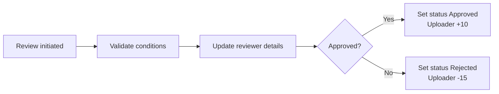
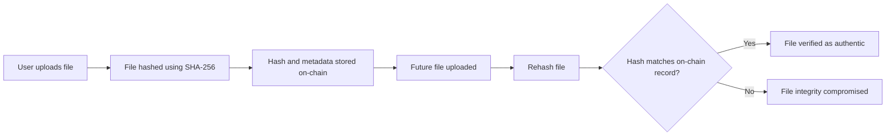

# BUSA3007
Blockchain Group Assignment 
The files uploaded are the smart contract, application codes and the evidence registery where all the files uploaded to the blockchain will stored. It stores the cyptographic file hashes on chain by avoidng the dependence on centralised storage and preventing post submission tampering. 

## Key Features 
* Tamper resistant evidence logging through blockchain immutability.
* SHA -256 file hashing for integrity verification.
* Smart Contrcat based access control with role authorisation. The role authorisation means there is an admin who can control the activities for the blockchain in terms of approving or rejecting submissions for users that have a score less than 70.
* Deterministic evidence verification through hash comparision. The file uploaded initially will have a hash and if it needs to be verified, the user has to upload the same file whereby the system will cross check the hash for the both the files.

## System Architecture 
There is 3 layers in the web application:
* Smart Contract ( found in the EvidenceRegistery.sol file) enforces system logic and store evidence metadata.
* Frontend(developed using Streamlit) provides an interface for evidence upload and verfication.
* Local Blockchain(Hardhat) used for development, testing and deployment.
Only evidence metadata(case ID, filehash, uploader address, timestamp) is stored in the system, while the actual files are processed off chain to maintain scalability.

## Smart Contract Capabilities 
* submitEvidence(): submit hashed evidence which is only for authorised users only.
* verifyEvidence(): verify file authenticity using hash comparison.
* getEvidence() : retrive stored evidence metadata.
* Role based user management with authoris/revoke functionaility.
  ### File Structure
  * id - unique identifier
  * caseID - links evidence to a case
  * fileHash - ensures integrity
  * fileName - original file name
  * uploader - who submitted
  * timestamp - upload time
  * status - Pending/Approved/Rejected
  * reviewedBY,reviewedAt,reviewNote
  * exists - prevents invalid access
## Access Control System 
1. Owner
   * full control
   * can:
       * Authorise/revoke users
       * set trust scores
       * review any evidence
 2. Authorised Users
    * can submit evidence
    * assigned trust scores
 3. Reviewers
    * Must satisfy the trust scores >= 90 or owner
    * can review pending evidence
      
## Trust Score Logic
The trust based scoring system limits evidence submission to:
* prevent abuse and over submission.
* enforce posting limits based on user.  
  ### Below is the logic for the canPost() :
* users below a minimum threshold are prevented from submitting evidence
* users within a mid-range threshold are allowed a limited number of submissions
* users above a higher threshold are allowed unrestricted activity
  ### Trust Score and Impact on Usage
   A new authorised user gets a score of 50 and it changes depending approval and        rejection. So if the evidence gets approved, thats an addition of 10 points and       minus 15 points is rejected. The maxiumum is 100 and minimum is 0.
   Below is a table that summarises the trust score:
   | Score Range   | Impact                                   |
   | ------------- | -------------------------------------    |
   | >= 90         | Reviewer priveileges,no posting limits   |
   | >= 70         | Auto approval of submission              |
   | >= 30         | Allowed to post                          |
   | < 30          | Blocked from posting                     |

   ### Review Logic

The flowchart above visulises a typical reviewing scenario.
## Posting Rate Limiting 
To prevent spam:
* Users with trust of < 90 - has a max submission of 3 per 24 hours.
* Users with trust >= 90 - has no limit.
This is coordinated through:
* postsInWindow
* Resets every 24 hours(lastresetTime)
  
## Workflow Overview 

The flowchart above shows that the user uploads a file, file is hased using SHA-256, hash and metadata are stored on chain. Any future file can be rehashed and verified against the blockchain record.

## Development & Limitations
* The system runs on a local Hardhat blockchain.
* Only one submission per case ID.
* There is no IPFS in the current prototype.
* Uses predefined private keys instaed of wallet based authentication.

## 🧩 Future Improvements 
* Integration with IPFS or decentralised storage.
* Wallet based authentication(Meta Mask).
* Public blockchain deplopyment. 
